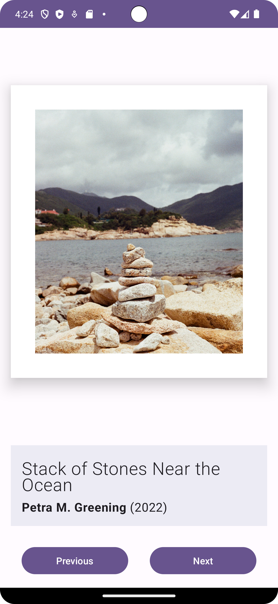
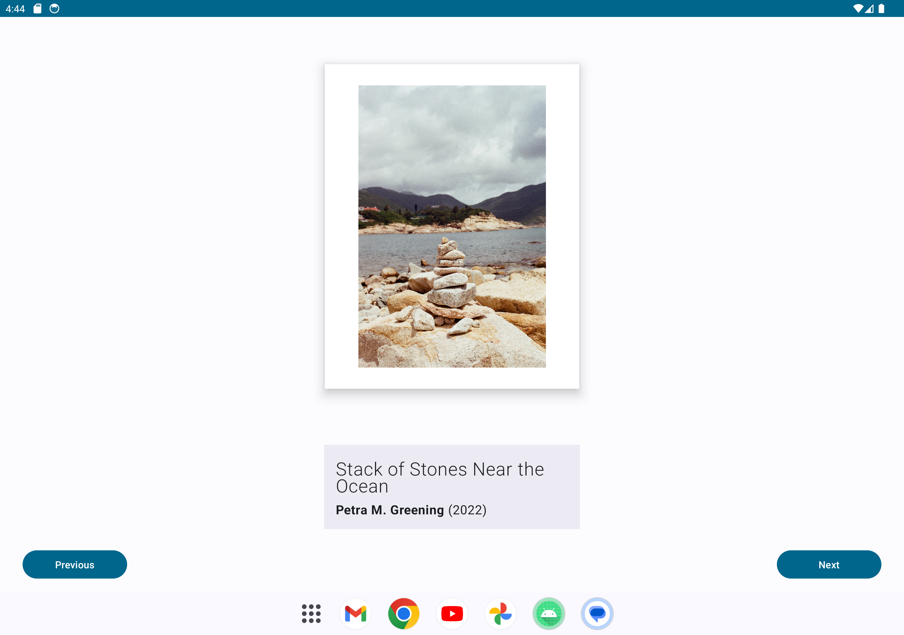

Art Space App
=================================

An Art Space app that displays an array of artwork showcase. It's developed using Jetpack Compose components like ```Column```, ```Button```, ```Text```, ```Image```, and ```Modifier```.


<p align="center">
  
</p>

<p align="center">
  
</p>

Getting Started
---------------
1. Install Android Studio, if you don't already have it.
2. Download the sample.
3. Import the sample into Android Studio.
4. Build and run the sample.

Resource
---------------

Thank you everyone for providing free images 😍


- Photo by Petra M. Greening from Pexels: https://www.pexels.com/photo/stack-of-stones-near-the-ocean-13073978/

- Photo by Thanh  Luu from Pexels: https://www.pexels.com/photo/a-building-with-a-roof-that-has-a-lot-of-tiles-15867258/

- Photo by Ebrart from Pexels: https://www.pexels.com/photo/a-boat-is-docked-in-a-harbor-19215726/

- Photo by Beyzaa Yurtkuran from Pexels: https://www.pexels.com/photo/a-man-sitting-on-a-bench-in-front-of-a-mosque-19216084/

- Photo by Josh Hild from Pexels: https://www.pexels.com/photo/close-up-of-red-flowers-17993800/

- Photo by Laura  Meinhardt from Pexels: https://www.pexels.com/photo/buildings-near-canal-in-city-15462405/

- Photo by Marius Schmidt from Pexels: https://www.pexels.com/photo/cliff-under-thick-clouds-3011836/

- Photo by Nati from Pexels: https://www.pexels.com/photo/boats-moored-in-the-marina-17137769/

- Photo by Alina Skazka from Pexels: https://www.pexels.com/photo/view-of-a-sea-and-a-rocky-shore-18444205/

- Photo by Miguel Andres Parra from Pexels: https://www.pexels.com/photo/a-path-through-a-forest-with-trees-and-plants-17893039/

- Photo by Esra Korkmaz from Pexels: https://www.pexels.com/photo/close-up-of-branches-with-bright-green-leaves-18499410/

- Photo by Karina Rymarchuk from Pexels: https://www.pexels.com/photo/autumn-19161821/

- Photo by Ellie Burgin from Pexels: https://www.pexels.com/photo/a-close-up-of-leaves-with-water-droplets-19274586/

- Photo by Nati from Pexels: https://www.pexels.com/photo/flag-and-street-light-over-narrow-street-18374442/

- Photo by Tobi &Chris from Pexels: https://www.pexels.com/photo/stars-over-rock-formation-18904092/

- Photo by Manuel Kapunkt from Pexels: https://www.pexels.com/photo/the-opera-house-at-night-with-reflections-in-the-water-19149719/

- Photo by Joe Fikar from Pexels: https://www.pexels.com/photo/new-town-19201304/

- Photo by Valeriia Miller from Pexels: https://www.pexels.com/photo/christmas-decorations-on-the-wooden-wall-of-a-house-11094846/

- Photo by Vitalii Kwink from Pexels: https://www.pexels.com/photo/metal-arc-16653685/

- Photo by Justin Wolfert from Pexels: https://www.pexels.com/photo/aerial-view-of-a-snowy-forest-with-clouds-14723250/